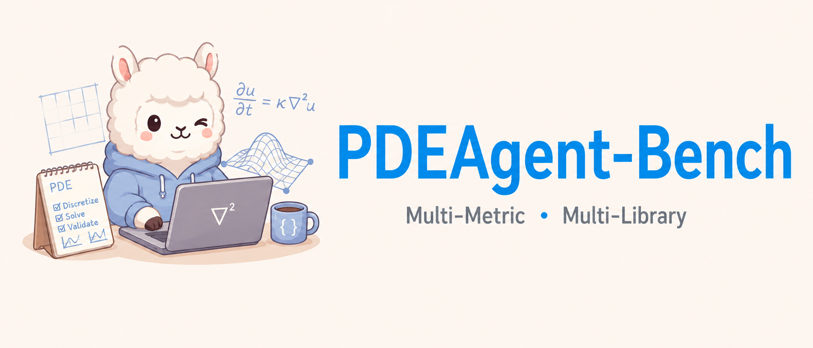

# PDEAgent-Bench: A Multi-Metric, Multi-Library Benchmark for PDE Solver Generation

<p align="center">
  
</p>

**PDEAgent-Bench** is a benchmark for evaluating LLM-based agents on partial differential equation (PDE) solving tasks. This repository hosts the official project page, deployed automatically to GitHub Pages via GitHub Actions.

**Live site:** [zeroeclipse00.github.io/pde-agent-bench-github-pages](https://zeroeclipse00.github.io/pde-agent-bench-github-pages/)

**Code repository:** [github.com/YusanX/pde-agent-bench](https://github.com/YusanX/pde-agent-bench)

## What's in this repo

| Path | Contents |
|---|---|
| `web/` | Source code for the project page (React frontend + FastAPI dev server) |
| `docs/` | Built static site — served by GitHub Pages |
| `.github/workflows/` | CI/CD: builds the frontend and deploys `docs/` on every push to `main` |

## Deployment

Pushing to `main` automatically builds and deploys the site. No manual steps needed.

To update site content (benchmark results, author info, figures, etc.), edit `web/server/app/data/mock.json` and push.

For local development and technical details, see [web/README.md](web/README.md).

## Citation

```bibtex
@misc{hang2026pdeagentbench,
  title  = {PDEAgent-Bench: A Multi-Metric, Multi-Library Benchmark for PDE Solver Generation},
  author = {Zhen Hang, Yushan Yashengjiang, Junhui Li, Huanshuo Dong,
            Yang Wei, Zhezheng Hao, Jiangtao Ma, Songlin Bai,
            Zhongkai Hao, Xihang Yue, Gangzong Si, Dongming Jiang,
            Chao Yao, Zhanhua Hu, Jianqing Zhang, Pengwei Liu,
            Yaomin Shen, Xingyu Ren, Lei Liu, Zikang Xu, Han Li,
            Qingsong Yao, Hande Dong, Hong Wang},
  year   = {2026},
  note   = {Under review at NeurIPS 2026},
  url    = {https://github.com/YusanX/pde-agent-bench}
}
```
